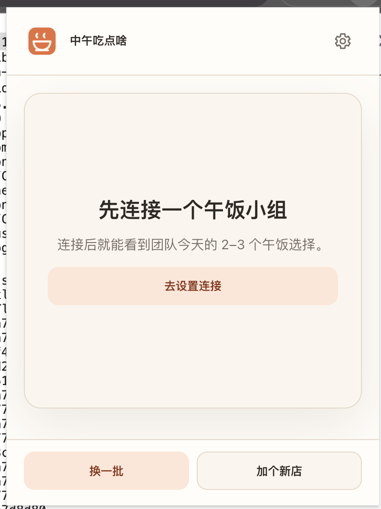
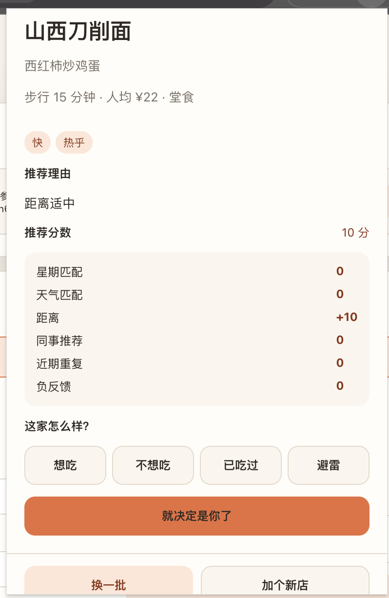

# Stage 7C Internal Beta Brand And Experience QA

Status: `Candidate packaged and Railway verified; real Chrome QA in progress`

Date: 2026-07-16

## Outcome

The Stage 7C implementation and committed candidate are complete:

- deterministic warm-bowl brand assets and shared visual tokens;
- branded Extension popup/options/detail and lightweight Admin brand alignment;
- visible AA-oriented keyboard focus and 40px primary Extension targets;
- complete Admin Modal focus containment helpers and behavior;
- shared Admin/Extension QuickAdd lost-response reconciliation with guarded retry;
- dev/internal Extension build profiles, `0.2.0`, exact production host and stable
  Extension ID `bbkeaogleldgfnkgebdhdbiohlmonbkk`;
- clean-worktree-only package command, checksum/release metadata contract and
  controlled unpacked install/upgrade/rollback documentation.

Candidate identity:

- source commit `2b2e48c063e3df7d5ccd7ac6a5a2b84dbc436497`;
- Extension ID `bbkeaogleldgfnkgebdhdbiohlmonbkk`;
- ZIP SHA-256
  `4a1db2cf62c998b6759f88dff1e775f91e7c6455dc037558effd8f2e4e9d948c`;
- Railway deployment `a1e581ad-cb05-48b3-b7f9-6db9858b4fb2`;
- Railway image digest
  `sha256:c31bbb92379f0a2c1594b96c475bf64666f57bee762f9be49ef7cfe4e9a0695c`.

No REST API, Prisma schema, identity model or Chrome permission category
changed. Production changed only the built Admin assets and the Railway
monorepo watch-path contract.

Stage 7D has not started. The candidate is not approved for colleague
distribution until real Chrome QA completes.

## Automated verification

Commands used Node `22.23.1` and pnpm `9.15.0`.

| Command | Result |
| --- | --- |
| `pnpm --filter @lunch/server prisma:generate` | PASS after allowing Prisma to update its user cache |
| `pnpm test` | PASS: 646 tests — Shared 31, Server 265, Admin 85, Extension 265 |
| `pnpm typecheck` | PASS |
| `pnpm build` | PASS; default Extension build is internal |
| `pnpm --filter @lunch/extension build:dev` | PASS |
| `pnpm build:railway` | PASS |
| `pnpm check:docs` | PASS: 59 Markdown files / 133 local links |
| `pnpm check:release-artifacts` | PASS: Admin, Extension, Server and Railway contract |
| `pnpm check:release-secrets` | PASS: no supplied secrets or tracked private-key file |
| `pnpm package:extension:internal` | PASS from a clean committed worktree |
| `pnpm check:stage7c-release` | PASS: both profiles, ZIP byte-for-byte match, icons, markup, exact host, stable ID, permissions, metadata and legacy-residue checks |
| `pnpm --filter @lunch/server exec vitest run tests/stage6RailwayContract.test.ts` | PASS: 3 tests, including complete monorepo watch paths |
| `git diff --check` | PASS |

The first full test/typecheck attempt after dependency installation failed
because Prisma Client had not yet been generated. After `prisma:generate`, the
unchanged Server suite and all Stage 7C suites passed.

## Brand and accessibility checks

- Canonical SVG:
  [`assets/brand/brand-mark.svg`](../assets/brand/brand-mark.svg).
- Generated 16/32/48/128 PNGs have RGBA output, brand-color pixels, manifest
  references and a measured 12.5% content safety margin.
- The 16px optical variant and 128px notification asset were visually inspected
  as local files.
- Popup, Options, Detail and Admin use the same SVG mark.
- Source/build checks reject the old `♨`, standalone `餐`, font glyph gear,
  character close icon and internal Stage/override wording.
- Primary warm-orange buttons use dark ink rather than white; the measured
  contrast is approximately 4.63:1. Focus indicators use a solid accent-ink
  outline plus a soft halo.
- Popup and Detail now have one persistent document-level `h1`; dynamic state
  and restaurant headings use `h2`.

## QuickAdd recovery checks

Automated coverage includes:

- normal restaurant + recommendation success;
- lost restaurant response with one confirmed new matching record;
- lost recommendation response with confirmed matching current-member content;
- confirmed-missing restaurant and recommendation safe retry;
- read failure and multiple candidates entering `uncertain`;
- matching content from another membership not being treated as this write;
- trimmed strings and de-duplicated/sorted tag comparison;
- same-name/same-area pre-write duplicate stop;
- no write retry from `uncertain`;
- group change before an action and while a write is in flight;
- per-step Admin/Extension context guards that prevent the second old-group
  write after a context change.

## Modal checks

Automated coverage includes:

- autofocus/first-control and dialog fallback;
- forward/reverse looping;
- focus recovery when active focus is outside;
- disabled, hidden, ancestor-hidden and non-visible controls;
- empty dialog fallback;
- Escape blocked while pending;
- restore only to a still-connected trigger.

Focusable controls are queried on every Tab key event so conditional rendering
and disabled-state changes are reflected immediately.

## Build and distribution checks

Internal profile:

- name `中午吃点啥（内部测试）`;
- version `0.2.0`;
- fixed service and sole host permission
  `https://lunchserver-production.up.railway.app/*`;
- public manifest key and computed ID
  `bbkeaogleldgfnkgebdhdbiohlmonbkk`;
- no localhost, Railway wildcard, legacy read token/path or remote font in the
  built runtime;
- advanced API editing hidden, with read-only version/service support details.

Dev profile:

- name `中午吃点啥（开发版）`;
- no internal key;
- localhost plus exact production host;
- advanced API editing enabled;
- separate Extension ID so it can coexist with the internal build.

Before the implementation commit, `pnpm package:extension:internal` was run as
a negative gate and correctly stopped with
`extension_package_requires_clean_worktree`. From the committed candidate it
produced and strictly validated:

```text
artifacts/extension/
  chidianma-extension-0.2.0-internal.zip
  chidianma-extension-0.2.0-internal.sha256
  chidianma-extension-0.2.0-internal.release.json
```

The ZIP:

- contains `manifest.json` at the archive root;
- passes `unzip -t`;
- contains 23 files;
- extracts identically into two separate directories;
- derives version `0.2.0` and Extension ID
  `bbkeaogleldgfnkgebdhdbiohlmonbkk` from both extracted manifests.

This confirms the fixed-key package contract statically. Actual Chrome loading
has passed for one candidate directory; loading from a second directory remains
a manual exit gate.

## Railway candidate evidence

Pre-deploy production baseline passed:

- `/api/health` HTTP 200;
- `/api/ready` HTTP 200 with database `ready`;
- Admin HTML HTTP 200;
- unauthenticated `GET /api/groups` HTTP 401;
- unknown `/api/*` HTTP 404 JSON.

The first upload, deployment `90bc0a54-dfab-42d6-a519-32025fb8c561`, was
`SKIPPED` without changing production because the service inherited a stale
`/apps/server/**`-only watch pattern. The repository now defines and tests the
complete Railway build inputs: Admin, Server, Shared and root pnpm/build
configuration.

Deployment `a1e581ad-cb05-48b3-b7f9-6db9858b4fb2` then reached `SUCCESS`:

- Shared, Prisma Client, Admin and Server builds passed;
- no migration was pending;
- all six read-only database verifier checks passed with count zero;
- `/api/ready` passed before promotion;
- the new Admin title `中午吃点啥 · 管理端` and `/brand-mark.svg` are live;
- deployed Admin JavaScript and CSS hashes exactly match the local candidate;
- health/readiness, protected 401 and unknown API 404 passed after promotion;
- no production HTTP 5xx was recorded in the deployment window.

Stage 7B deployment `6d80eb52-d35a-4554-9d66-aa44dd2d6b1c` remains the
immediate application rollback point. Both PostgreSQL services remain intact.

## Real Chrome candidate evidence

Chrome:

- Google Chrome `150.0.7871.125` Official Build, `x86_64`.
- The internal build loaded successfully through `chrome://extensions` →
  **Load unpacked**.
- Chrome reported the expected name `中午吃点啥（内部测试）`, version `0.2.0`
  and Extension ID `bbkeaogleldgfnkgebdhdbiohlmonbkk`.
- The loaded `apps/extension/dist` content was byte-for-byte matched to the
  versioned candidate ZIP by the strict release gate.

Popup disconnected-state visual review passed by user confirmation and
screenshot inspection:

- the warm-bowl Logo is recognizable and correctly aligned;
- product name and inline SVG settings gear render clearly;
- the connection guidance card, primary action and footer actions preserve the
  intended hierarchy;
- no clipping, overlap or unexpected internal scrolling is visible;
- button labels and disconnected wording use the approved user-facing language.



Screenshot archive:
`qa/screenshots/stage7c/chrome-150-popup-disconnected.png`, 798×1064 PNG,
SHA-256 `13fd91e07416f8be885fc591ba073429038e86cae18997fbc5c76d79d660ab21`.

Options-page review passed by user confirmation in the same Chrome candidate:

- the Popup settings gear opens the Options page;
- the page uses the approved `中午吃点啥 / Chrome 扩展设置` naming;
- support information reports version `0.2.0`;
- the service address is the fixed production Railway origin;
- the internal profile does not expose an API-address editing control.

Identity connection and recommendation-entry review passed by user confirmation:

- an already connected Admin generated a 10-minute identity link code;
- the Extension redeemed the link code successfully without exposing the code
  or any Token in QA evidence;
- the Extension restored the expected existing identity and lunch group;
- returning to the Popup displayed the active group name and entered the
  recommendation experience successfully.

Connected Popup recommendation-flow review passed by user confirmation:

- the Popup displayed 2–3 recommendation cards without clipping or unexpected
  scrolling;
- recommendation reasons were readable;
- `换一批` refreshed the recommendation batch successfully;
- selecting a recommendation opened its detail state;
- decision, feedback, retry and settings controls rendered normally.

The archived detail-state screenshot directly confirms:

- restaurant and dish hierarchy;
- distance, price, dining mode and attribute tags;
- recommendation reason and explainable score breakdown;
- four feedback choices and the primary decision action;
- consistent typography, spacing, warm color tokens and visible footer actions,
  without overlap or clipping at the candidate Popup width.



Screenshot archive:
`qa/screenshots/stage7c/chrome-150-popup-detail-ready.png`, 798×1226 PNG,
SHA-256 `5ec1fc24eb4f278dd49c987681ba8bf0ca48fc0a87f8af23667449c7caadff93`.

QuickAdd normal-path review passed by user confirmation:

- `加个新店` opened the QuickAdd flow;
- a real, non-duplicate restaurant and recommendation were accepted;
- both writes completed successfully without a duplicate or uncertain state;
- the newly saved knowledge was visible in the Admin restaurant library;
- no restaurant, recommendation, member or Token value is retained in this QA
  evidence.

Lunch-decision review passed by user confirmation:

- the primary `就决定是你了` action completed successfully;
- the Extension entered the expected `你已经选好今天的午饭` state;
- no selected restaurant or member detail is retained in this QA evidence.

Feedback interaction review passed by user confirmation:

- one of the four feedback actions was submitted;
- the feedback controls displayed the expected pending/disabled behavior while
  the request was in progress;
- the request completed without an error message;
- no duplicate feedback was created;
- refreshing the Popup after completion preserved a normal working state;
- the selected feedback value is not retained in this QA evidence.

Extension Reload retention review passed by user confirmation:

- Reload from `chrome://extensions` preserved the expected Extension name,
  version `0.2.0` and stable ID `bbkeaogleldgfnkgebdhdbiohlmonbkk`;
- the linked identity and active group remained connected;
- reminder settings remained intact;
- the Popup recommendation state remained available after Reload.

This verifies Reload persistence for the currently loaded candidate directory.

Candidate-directory replacement review also passed by user confirmation:

- the same versioned `0.2.0` ZIP was extracted over the currently loaded
  candidate directory;
- Reload completed with the expected name, version and stable Extension ID;
- identity, active group, reminder settings and recommendation state remained
  intact after file replacement;
- this verifies the documented same-version controlled unpacked update flow,
  but does not claim future cross-version storage migration compatibility.

Stable-ID cross-directory review passed by user confirmation:

- the same candidate ZIP was extracted into a second new directory;
- loading that directory through **Load unpacked** produced the same Extension
  ID `bbkeaogleldgfnkgebdhdbiohlmonbkk`;
- this confirms the committed public manifest key stabilizes the Chrome
  development-install ID independently of extraction directory.

## Manual QA still required

- Real Chrome light/dark toolbar check for the 16px icon.
- Popup loading, empty, cached and error states.
- QuickAdd lost-response recovery and uncertain-state behavior.
- Detail desktop layout and system notification icon.
- Admin desktop/390px layout and live Modal keyboard behavior.
- Record screenshots for the remaining states.

Migration rehearsal was not rerun because Stage 7C changes no Server behavior,
Prisma schema or migration.
